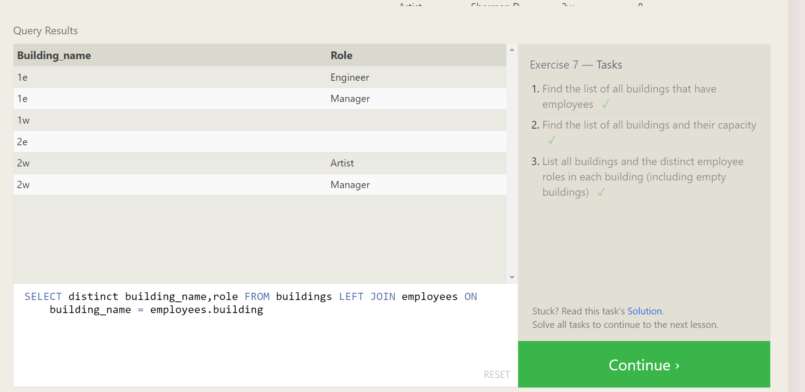

## This repo is to perform various task in using Mysql Database!

## Lesson 1 : SELECT queries 101

**1.Find the title of each movie**

**2.Find the director of each film**

**3.Find the title and director of each film**

**4.Find the title and year of each film**

**5.Find all the information about each film**

## Lesson 2: Queries with constraints

**1.Find the movie with a row id of 6**

**2.Find the movies released in the years between 2000 and 2010**

**3.Find the movies not released in the years between 2000 and 2010**

**4.Find the first 5 Pixar movies and their release year**

## Lesson 3 : Queries with constraints

**1.Find all the Toy Story movies**

**2.Find all the movies directed by John Lasseter**

**3.Find all the movies (and director) not directed by John Lasseter**

**4.Find all the WALL- movies**

## Lesson 4: Filtering and sorting Query results

**1.List all directors of Pixar movies (alphabetically), without duplicates**

**2.List the last four Pixar movies released (ordered from most recent to least)**

**3.List the first five Pixar movies sorted alphabetically**

**4.List the next five Pixar movies sorted alphabetically**

## Lesson 5 : Review Simple SELECT Queries

**1.List all the Canadian cities and their populations**

**2.Order all the cities in the United States by their latitude from north to south**

**3.List all the cities west of Chicago, ordered from west to east**

**4.List the two largest cities in Mexico (by population)**

**5.List the third and fourth largest cities (by population) in the United States and their population**

## SQL Lesson 6: Multi-table queries with JOINs

**1.Find the domestic and international sales for each movie**

**2.Show the sales numbers for each movie that did better internationally rather than domestically**

**3.List all the movies by their ratings in descending order**

## Lesson 7 : OUTER JOINs

**1.Find the list of all buildings that have employees**

**2.Find the list of all buildings and their capacity**

**3.List all buildings and the distinct employee roles in each building (including empty buildings)**

## Lesson 8 : A short note on NULLs

**1.Find the name and role of all employees who have not been assigned to a building**

**2.Find the names of the buildings that hold no employees**

## Lesson 9 : Queries with expressions

**1.List all movies and their combined sales in millions of dollars**

**2.List all movies and their ratings in percent**

**3.List all movies that were released on even number years**

